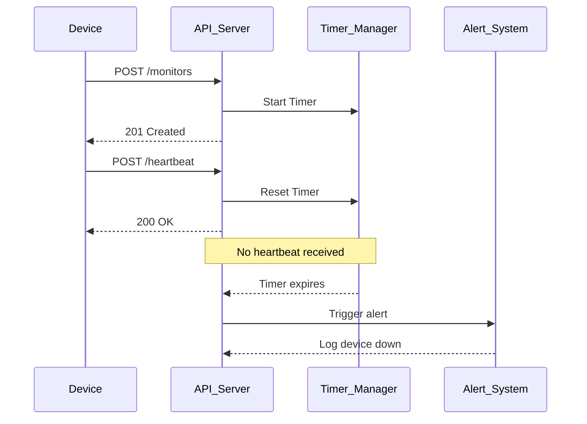

# Dead man's switch API

## Overview of the Project
This system implements a dead man's switch API which detects whether a monitoring device is active or not.

## Problem
CritMon provides monitoring for remote solar farms and unmanned weather stations in areas with poor connectivity. These devices are supposed to send "I'm alive" signals every hour. Currently, CritMon has no way of knowing if a device has gone offline (due to power failure or theft) until a human manually checks the logs. They need a system that alerts them when a device stops talking.

## Solution
This API allows devices to register monitors and send heartbeats. A timer tracks device activity and triggers alerts when devices stop communicating.

## System Architecture
flowchart TD
```mermaid
Device --> API
API --> TimerService
API --> Database
TimerService --> AlertSystem
AlertSystem --> AlertLogs

```

## Sequence Diagram
