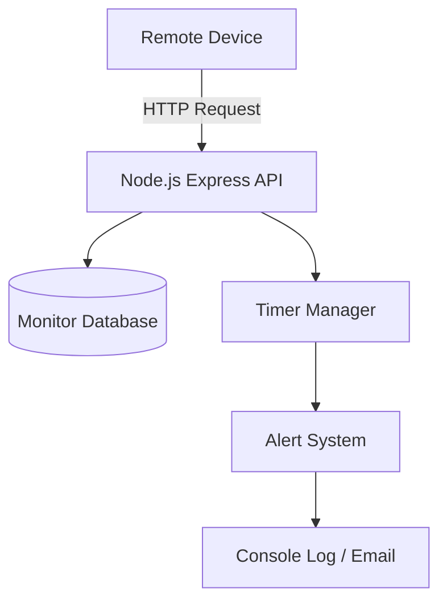
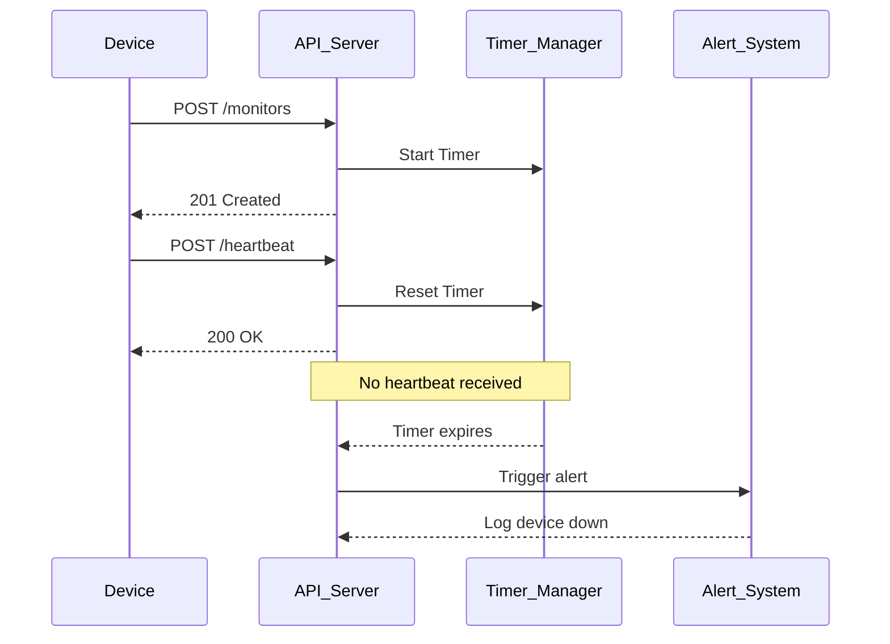

# Dead Man's Switch API
A Node.js/Express backend service that monitors remote devices using a Dead Man’s Switch mechanism. Devices must periodically send heartbeat signals or the system automatically triggers alerts.

## Overview of the Project
This system implements a dead man's switch API which detects whether a monitoring device is active or not.

## Problem
CritMon provides monitoring for remote solar farms and unmanned weather stations in areas with poor connectivity. These devices are supposed to send "I'm alive" signals every hour. Currently, CritMon has no way of knowing if a device has gone offline (due to power failure or theft) until a human manually checks the logs. They need a system that alerts them when a device stops talking.

## Solution
This API allows devices to register monitors and send heartbeats. A timer tracks device activity and triggers alerts when devices stop communicating.

## System Architecture

## Sequence Diagram

## API endpoints
### register devices
POST "/api/monitor"

### Example Request
{
    "deviceId":"device-123",
    "timeout":"20",
    "alert_email":"test@gmail.com"
}
### Response
{
    "message":"Device registered successfully",
    "device":{"deviceId":"device-123",
    "timeout":20,
    "alert_email":"test@gmail.com",
    "status":"active",
    "_id":"69b82801dc01d01283d3515d",
    "createdAt":"2026-03-16T15:55:45.721Z",
    "updatedAt":"2026-03-16T15:55:45.721Z",
    "__v":0}
}

### heartbeat signal
POST "/api/monitor/{id}/heartbeat"

### API response:
{
    "message":"Heartbeat received. Timer reset.",
    "device":"device-123"
}

### Timer Pausing

POST "/api/monitor/{id}/pause"

### API response
{
    "message":"Device paused successfully"
}

## Developer Choice: Monitor status of every device
To improve observability and system usability, the API provides an endpoint that allows administrators to check the current status of monitored devices.

Instead of relying only on alerts, this feature provides real-time insight into:

Last heartbeat time and
Current monitoring status.

This makes it easier for support engineers to monitor system behavior and diagnose connectivity issues.

### get all devices
GET "/api/monitor/get-devices"

### Response
{
    "devices": [
        {
            "_id": "69b82801dc01d01283d3515d",
            "deviceId": "device-123",
            "timeout": 20,
            "alert_email": "test@gmail.com",
            "status": "qctive",
            "createdAt": "2026-03-16T15:55:45.721Z",
            "updatedAt": "2026-03-16T17:44:53.298Z",
            "__v": 0
        },
        {
            "_id": "13r52801dg56j01283d35678",
            "deviceId": "device-456",
            "timeout": 10,
            "alert_email": "test2@gmail.com",
            "status": "paused",
            "createdAt": "2026-03-16T15:55:45.721Z",
            "updatedAt": "2026-03-16T17:44:53.298Z",
            "__v": 0
        }
    ]
}
This feature improves the system by providing faster troubleshooting for engineers and a simple way to monitor
multiple devices.

## How to run
Ensure Node.js is installed on your system

1. clone the repository and after, run "cd Pulse-Checker-API" in your terminal
2. create an .env file in the project root directory and add these variables
DB = your_mongodb_connection_string (Make sure you have entered the correct mongoDB URI before you start the server)
PORT = 8000 (you can change to your preferred port number)
3. run "npm install" to required dependencies
4. run "npm run dev" to start the server

